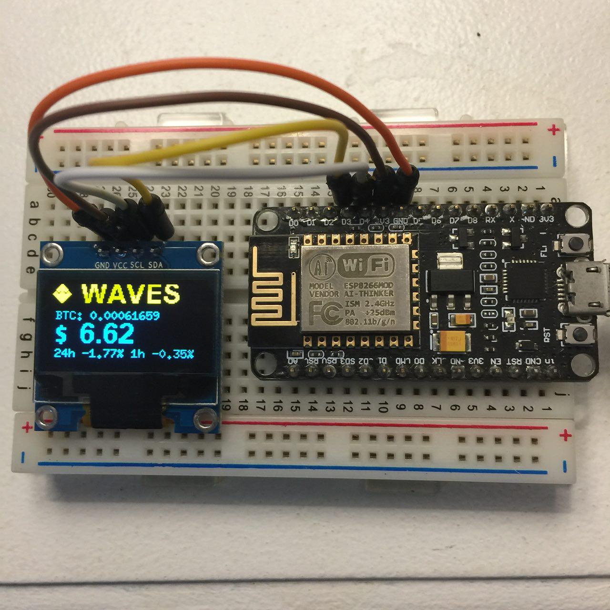

# cryptotracker_nodemcu

Images: https://imgur.com/a/Xdcik

## Hardware

- NodeMcu: https://www.amazon.es/gp/product/B06Y1ZPNMS
- OLED Screen: https://www.amazon.es/gp/product/B01N2K3BC9

## Software

- IDE to edit and upload code: https://esp8266.ru/esplorer/
- Firmware Builder: https://nodemcu-build.com/ (U8G and i2C required for screen, and HTTP and SSL for API calls)

I used this code as a base; https://hackaday.io/project/28610-crypto-ticker
And modified it to load different coins and page between them, refactored it a bit, Modified the screen layout and added some extra info, and created new icons for coins

I Just updated the screen display file and moved pins 3/4 to 1/2 as 4 is connected to the blue LED and flashes when you pull that pin low, and it was annoying me. Now the screen updates without flashing the blue LED (It lights up the entire room during the night!) But if you want it on, stick with 3/4

Next: Working on adding an extra screen, and some 'alert' LED flashing, and portfolio tracking (1 day % vs My investment %)
